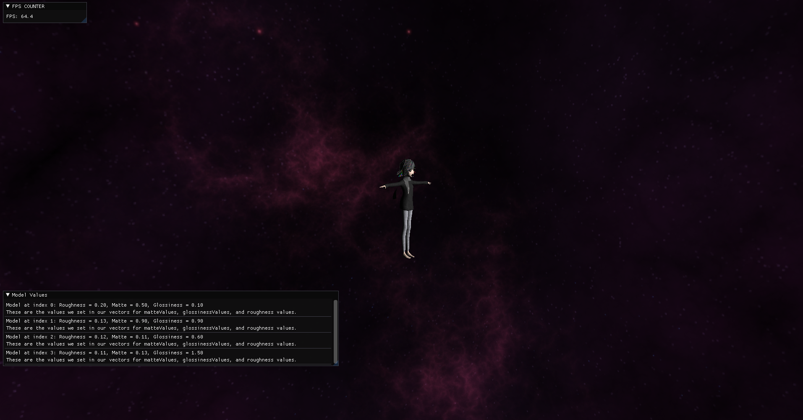
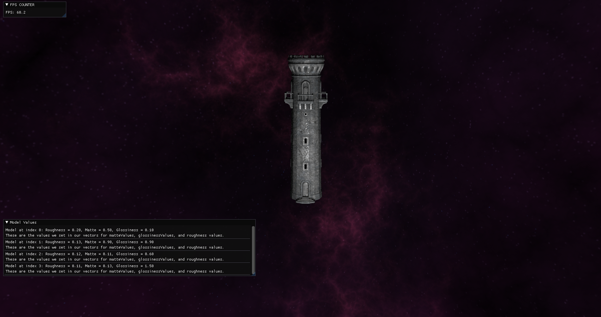
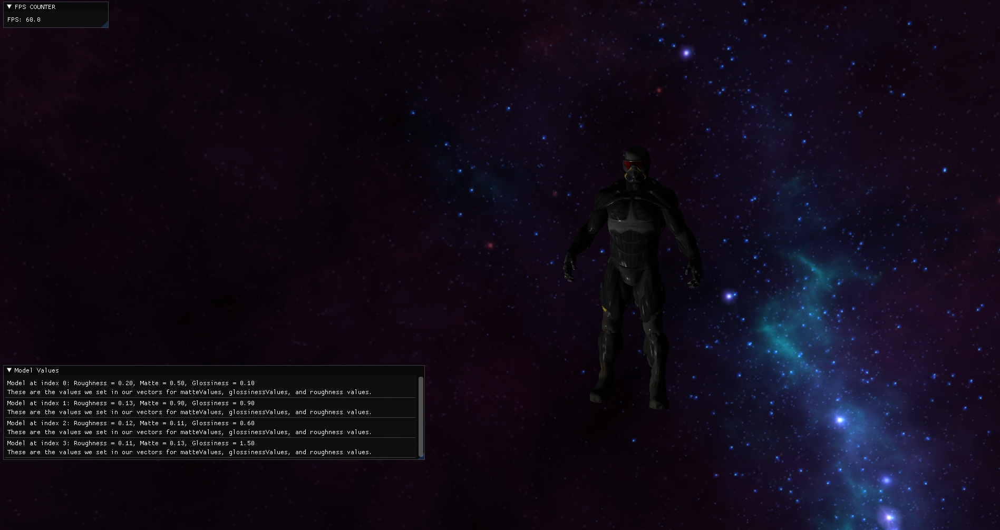
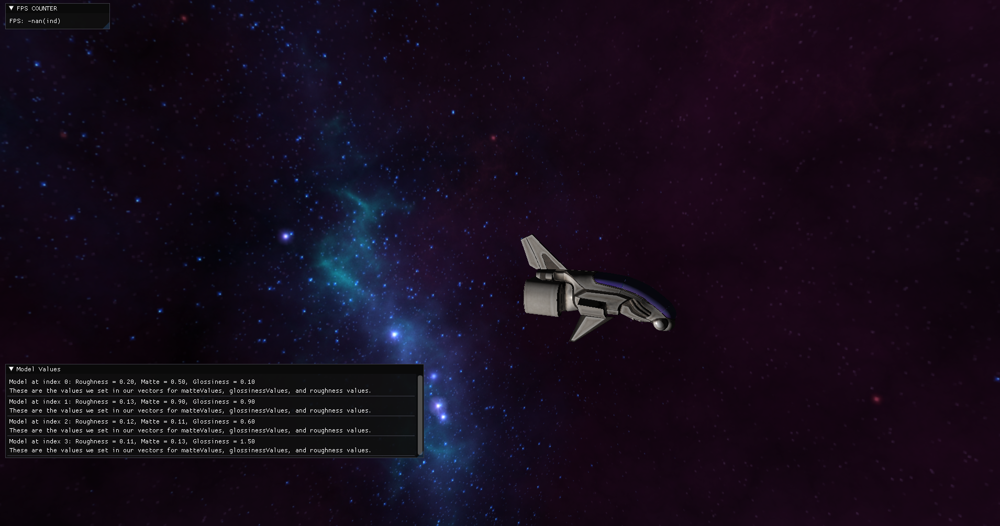

# OpenGL 3D Model Viewer

Developed an application using OpenGL to load and display 3D models. Implemented Blinn-Phong lighting in a 3D environment displaying the values in a user interface created using ImGui. This project was created during the second semester of my second year in college.

## Technologies Used:
- C++,OpenGL, GLSL, ImGui

## Project Features
- The user can move around the space using A,W,S,D keys.
- The user can load a different model by Pressing M.
- The Values of each model like Roughness, Matte and Glossiness show up in the UI.
- The FPS of the application are shown in the UI.

## How to Install
1. Clone this GitHub Repository to your computer.
2. Open the Project .sln file in Visual Studio and run it.

## Screenshots

